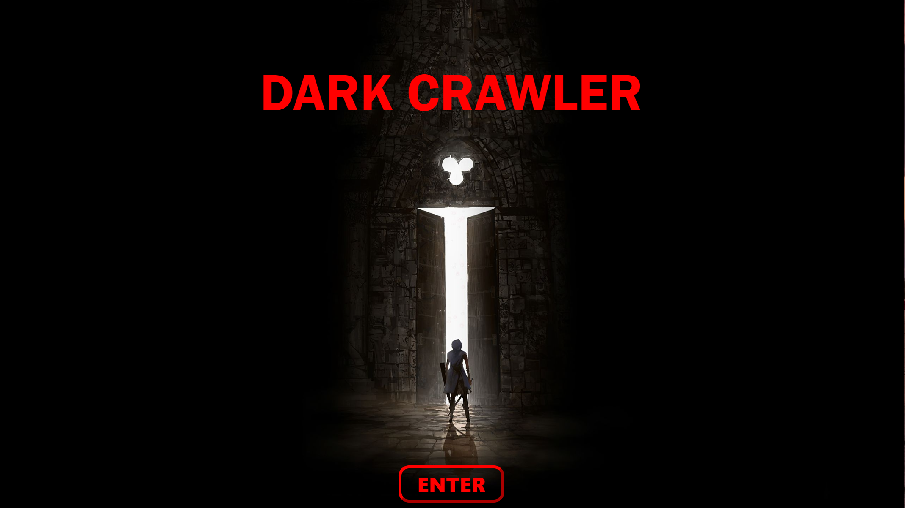
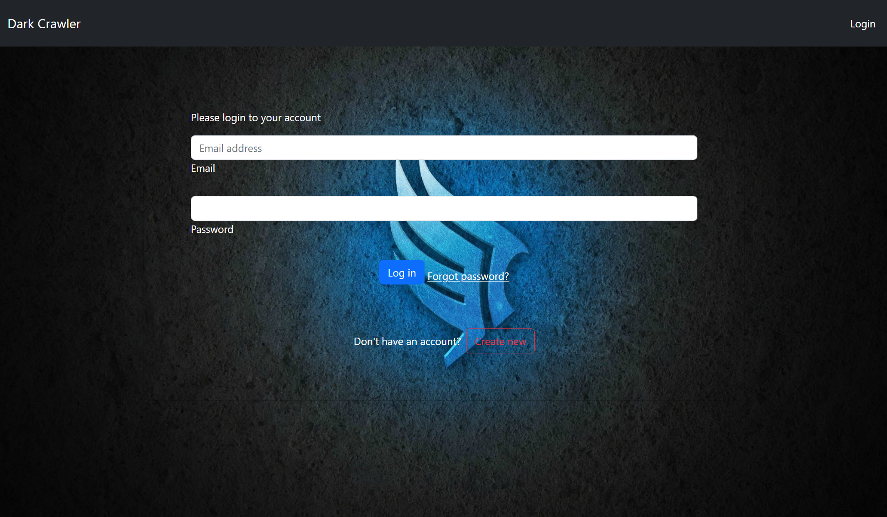
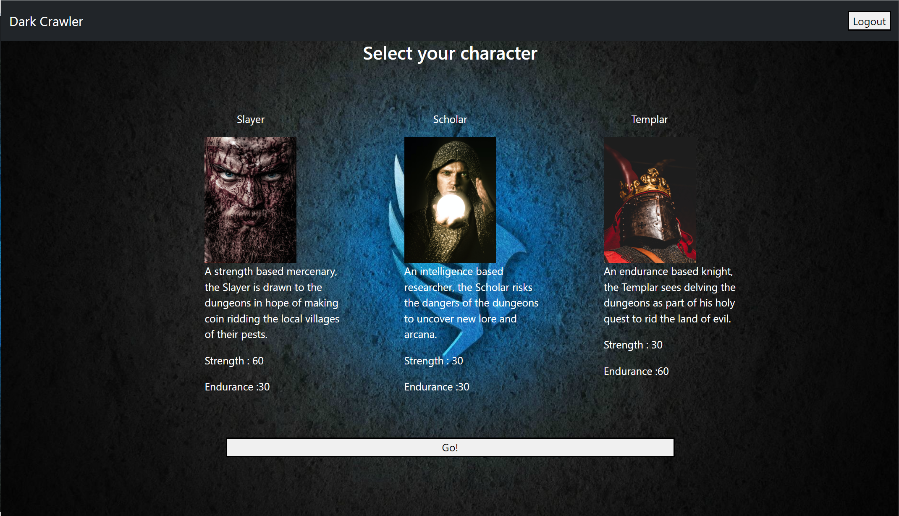
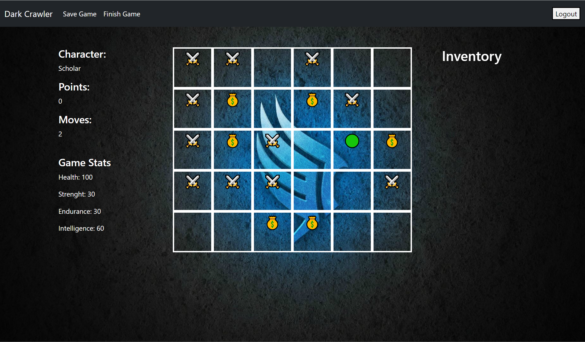

# Dark Crawler

  
    

  


## Description

Dark Crawler is a full stack application that offers a fully functioning board game, with randomized encounters and rewards, each play through will be different and offers incredible amounts of replay value for our users. Given a user is logged-in, they are able to select a character and start a new game, or can continue/resume to play the game from where they left.

This application is inspired by early dungeons and dragons style tabletop gaming, our team has come together to offer users the ability to enjoy the greatest excitements of obtaining loot and surviving dangerous encounters in a web application environment. It was made as part of the group project to learn about full-stack applications created with Model-View-Controller.

Dark Crawker application is following the MVC paradigm in its architectural structure, and uses uses various npm packages such as, `express-handlebars` as the templating language, `express`, `dotenv`, ` bcrypt` and `express-session` npm packages for authentication, `sequelize`, `connection-session-sequelize` as the ORM, `mysql2` for the back-end. It was build completely from scratch and deployed to Heroku.

## User Story

```md
AS A gamer
I WANT to be able to enjoy all the fun of 
dungeons on a web app as a single player
SO THAT I can play at my convenience
```

## Acceptance Criteria

```md
GIVEN a CMS-style board game
WHEN I visit the site for the first time
THEN I am presented with the homepage, which includes name of the game; navigation links for the main page.
WHEN I click on the main page link
THEN I am prompted to either sign up or sign in
WHEN I choose to sign up
THEN I am prompted to create a username, email and password
WHEN I click on the sign-up button
THEN my user credentials are saved and I am logged into the site
WHEN I revisit the site at a later time and choose to sign in
THEN I am prompted to enter my email and password
WHEN I am signed in to the site
THEN I am taken to the welcome page which includes option to start a new game or continue the existing game; navigation links for the homepage and the dashboard; and the option to log out
WHEN I click on the new game option
THEN I am taken to the character selection screen
WHEN I select the character option
THEN I am taken to the game page which displays current character abilities, and option to make the next move or finish the game; navigation links for the homepage and dashboard; and the option to logout
WHEN I click on the make a move option
THEN the user pointer moves to the next available tile on the game grid, which includes encounter points and/or reward prize
WHEN the user pointer comes across encounter or reward
THEN the character abilities reflect the value of that encounter or reward and displays on the screen
WHEN I click on finish the game
THEN I am taken back to the welcome screen with options to start a new game or continue the game
WHEN I click on the logout option in the navigation
THEN I am signed out of the site
WHEN I am idle on the site for more than a set time
THEN I am prompted to log in again before I can play the game

```

# Screenshots

The following screens demonstrates the application functionality:

## Homepage

 

## Login Screen

 

## Dashboard

 

## Character Selection

 

## Game

 

## Heroku Deployment

https://dark-crawler.herokuapp.com/

## Table-of-Contents
* [Installation](#installation)
* [Usage](#usage)
* [Technologies](#technologies)
* [License](#license)
* [Contributing](#contributing)
* [Questions](#questions)
* [Credits](#credits)

## [Installation](#table-of-contents)

```
npm i

npm run seed

npm start
```
## [Usage](#table-of-contents)
This project was built in Node.js using the express and sequelize packages utilizing the MVC paradigm.

## [Technologies](#table-of-contents)
* JS
* Node.js
* MongoDB
* Handlebars
* Model-View-Controller
* dotenv
* MySQL
* Cookies
* Sessions

## [License](#table-of-contents)
The application is covered under the following license: [MIT](https://choosealicense.com/licenses/mit/)

## [Contributing](#table-of-contents)
To contribute to this application, create a pull request or fork the repo.

## [Questions](#table-of-contents)
If you have any question about the repo, open an issue.

## [Credits](#table-of-contents)

| Contributors                             | Roles                       | Tasks                    |
| ---------------------------------------- | --------------------------- | ------------------------ |
| Rob Davis | Project Manager/Coder & Scoping | Rendering, Design        |
| Matthew Fernandez | Full Stack Coder/Model Builder | Rendering, Models        |
| Murad Ali | Full Stack Coder/View Designer | Rendering, Design |
| Umair Khalid | Full Stack Coder/Main Code | Routes, Design |


---
© 2022 Dark. Confidential and Proprietary. All Rights Reserved.
